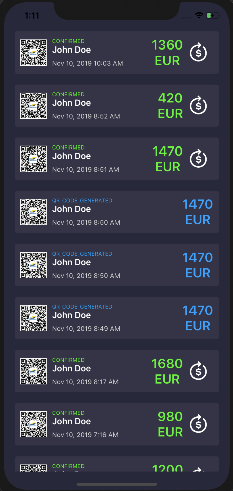

# PomeloPay HW



## Introduction

This is source code for Pomelo Pay Homework (React Native)

## Main technnologies and libs

React Native, redux, redux-saga, styled-components

## Code standards

Follow: [ESLint](https://eslint.org/), [Prettier](https://prettier.io/)

IDE: [Visual Studio Code](https://code.visualstudio.com/)

Dependency Management: [Yarn](https://yarnpkg.com/en/)

## Setup project

### 1. Setup environment

https://facebook.github.io/react-native/docs/getting-started

### 2. Clone and install dependencies

```bash
$ git clone <repo>
$ cd <path_to_project>
$ yarn install
$ cd ios && pod install
```

### 3. Run the app for development

Start bundle server

```bash
$ yarn start
```

iOS app

```bash
$ yarn ios (run on iPhone simulator)
```

Android app

```bash
$ yarn android
```

## Directory structure

```
.
└── src
  ├──components 			# only contain doom components (show UI only)
  │ └──__tests__ 			# unit tests and snapshots of unit tests
  ├──constants			# contain common layouts, colores, image paths, keys, configs, routes…
  ├──redux 				# define and initial store for global data
  │ ├──actions 			# receive and handle requests from UI view and dispatch to reducers
  │ ├──sagas			# redux sagas
  │ └──reducers 			# contains global data and deliver to UI view
  ├──screens 				# all screens of the app
  ├──services 			# handle request API, login services…
  └──utils 				# common functions, helpers and tools…

```

## License

MIT
